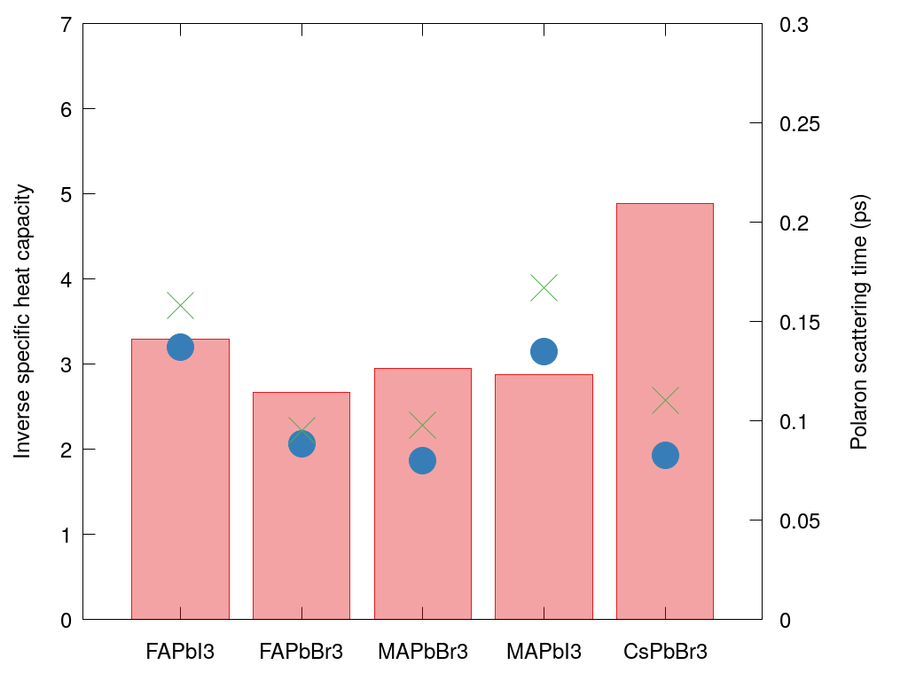
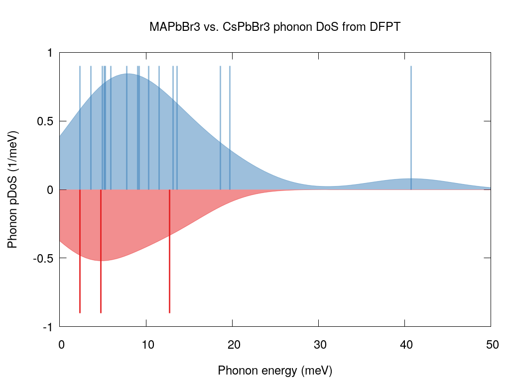

# 2018-05-Hopper-polaron-cooling
Data to be published with Tom Hopper's Ultrafast Intraband Spectroscopy of Hot-Carrier Cooling in Lead-Halide Perovskites

## Predicted scattering time constants

`ArtemHopper.jl` when run under Julia 0.6, with the PolaronMobility.jl package installed, should reproduce the data used in the publication. 
The `STDOUT` has been redirected and archived as `ArtemHopper.stdout`.

Final versions of the figures were generated by Tom, I used built-in PlotPolaron functions for initial exploration, and then GNUPlot for intermediate figures, while interacting with the co-authors on how best to display the data.

# Phonon spectral density

These are phonon density of states generated by convolving (with Gaussians, a kdensity estimation) the gamma-point phonon modes.

